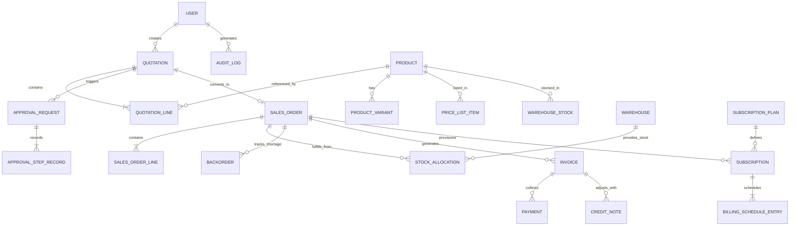

# DealFlow360 — Architecture & Data Model Documentation

## 1. System Overview

**DealFlow360** is an intelligent, self-governing B2B Sales Operations Platform designed to streamline the complete quotation-to-cash workflow. It replaces static quote forms with a dynamic deal engine that enforces discount governance, manages real-time multi-warehouse inventory splitting, reconciles hybrid billing (one-time products + recurring subscriptions), and enables direct customer portal negotiation.

```
+-----------------------------------------------------------------------------------+
|                                  USER INTERFACES                                  |
|  +-------------------+  +-------------------+  +-----------------+  +-----------+ |
|  | Sales Rep Wkspace |  | Manager Dashboard |  | Customer Portal |  | Admin UI  | |
|  +---------+---------+  +---------+---------+  +--------+--------+  +-----+-----+ |
+------------|----------------------|---------------------|-------------------|-----+
             |                      |                     |                   |
             +----------------------+---------+-----------+-------------------+
                                              |
                                              v
+-----------------------------------------------------------------------------------+
|                                  EXPRESS ROUTERS                                  |
|  /auth | /quotations | /approvals | /discounts | /warehouses | /subscriptions |   |
|  /upsell | /finance | /reports | /admin | /dashboards | /warehouse-stock          |
+-----------------------------------------------------------------------------------+
                                              |
                                              v
+-----------------------------------------------------------------------------------+
|                                  SERVICES LAYER                                   |
|  +--------------------+  +--------------------+  +-----------------------------+  |
|  | QuotationsService  |  |  DiscountsService   |  |     InventoryService        |  |
|  +--------------------+  +--------------------+  +-----------------------------+  |
|  |  ApprovalsService  |  | SubscriptionsService |  |       FinanceService        |  |
|  +--------------------+  +--------------------+  +-----------------------------+  |
|  |   UpsellService    |  |   ReportsService   |  |        AdminService         |  |
|  +--------------------+  +--------------------+  +-----------------------------+  |
+-----------------------------------------------------------------------------------+
                                              |
                                              v
+-----------------------------------------------------------------------------------+
|                                PRISMA ORM & SQLITE                                |
|  User | Quotation | QuotationLine | Product | PriceList | Warehouse | Stock |     |
|  ApprovalRequest | Subscription | Invoice | Payment | Backorder | UpsellRule          |
+-----------------------------------------------------------------------------------+
```

---

## 2. High-Level Data Model Architecture

The data model connects eight core domain modules into a single cohesive relational graph:



---

## 3. Module Breakdown & Connections

### 1. **Authentication & User Scoping (`auth/`)**
- Supports role-based access control (`REP`, `MANAGER`, `FINANCE`, `ADMIN`, `CUSTOMER`).
- Generates restricted JWT tokens for internal workspace users and tokenized Magic Links for customer portal access.

### 2. **Product Catalog & Price List Management (`products/`)**
- Manages products, variants (attribute/value with extra price), tax rates, unit types, and customer-tier based price lists.

### 3. **Discount Governance & Risk Engine (`discounts/`)**
- Evaluates line items against 3-tier ceilings (Bronze 5%, Silver 10%, Gold 15%) and category ceilings (Hardware 15%, Software 10%, Services 5%).
- Computes a blended risk score (Discount Ceiling Risk + Margin Risk + Blended Order Risk + Historical Anomaly Risk).

### 4. **Approval Routing Engine (`approvals/`)**
- Automatically routes deals to `MANAGER` or `MANAGER_THEN_FINANCE` depending on risk thresholds.
- Enforces strict role permission checks and logs every approval/rejection step in `AuditLog` and `ApprovalStepRecord`.

### 5. **Warehouse & Multi-Site Inventory (`warehouses/`)**
- Manages multi-warehouse fulfillment splitting, shipping cost weighting, automated inventory allocation, and backorder consolidation.

### 6. **Subscriptions & Hybrid Billing (`subscriptions/`, `finance/`)**
- Handles mixed orders containing both one-time products and recurring subscriptions.
- Calculates mid-cycle proration, automated billing schedule entries, cancellation partial refunds, and credit notes.

### 7. **Upsell & Cross-Sell Engine (`upsell/`)**
- Uses historical co-purchase scores and promoted rules to surface live product suggestions with real-time margin impact deltas.

### 8. **Deal Health & Reporting Analytics (`reports/`, `src/dashboards/`)**
- Monitors stalled deals, discount anomalies, and delivery promise slippage.
- Provides PDF/XLS/CSV export options and automated nudge/escalation triggers.

---

## 4. Deliverable Note: What We Would Build Next (Future Roadmap)

With additional development time, the team would expand DealFlow360 with:

1. **AI-Powered Negotiator Assistance**: Natural Language Processing (NLP) to analyze customer counter-proposals and recommend optimal concession terms to reps.
2. **Multi-Currency Real-Time Exchange Sync**: Automatic FX rate conversion and multi-company intercompany transfer pricing rules.
3. **Advanced Inventory Logistics Integration**: Direct Webhook integrations with 3PL providers (FedEx, DHL, UPS) for live tracking and shipment cost estimation.
4. **Contract E-Signature Integration**: Embedded DocuSign/Adobe Sign flows directly inside the Customer Portal negotiation view.
